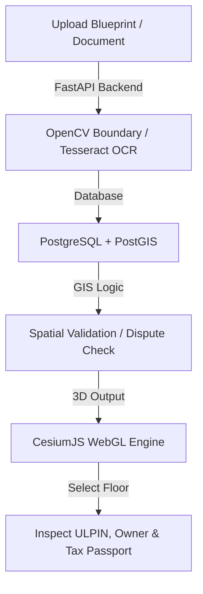

# 3D ULPIN Generation & Vertical Property Mapping System

[](https://propertymap-system.web.app)
[](#)
[](https://propertymap-system.web.app)

> **SIH26011** — An integrated, high-fidelity 3D spatial cadastre system that generates unique 3D Unified Land Parcel Identification Numbers (ULPINs), maps vertical properties, and detects zoning and boundary overlaps using PostGIS.

### 🌐 Live Production Application
The frontend GIS interface is fully deployed and accessible at:
👉 **[https://propertymap-system.web.app](https://propertymap-system.web.app)**

---

## 1. Project Goals & Objectives

This system is a working prototype of a **3D Cadastral & Vertical Property Management System** designed to:
1. **Dynamic 3D GIS Visualization**: Render land parcels and building structures in 3D using CesiumJS.
2. **Vertical Floor Segmentation**: Segment volumetric buildings into distinct, interactive floors/vertical property units.
3. **Unique 3D ULPIN Encoding**: Generate standardized, unique 3D ULPINs for vertical strata (e.g., `ParcelID-F00X-Z404`).
4. **Blueprint to 3D Generation**: Process uploaded architectural 2D floor plans into basic 3D structures using OpenCV contours.
5. **Property Document OCR**: Extract owner names, floor area, and deed details from uploaded files using Tesseract OCR.
6. **PostGIS Spatial Dispute Detection**: Check for boundary violations and overlaps against roads or neighboring parcels.
7. **Volumetric Property Tax Calculator**: Calculate dynamic property taxes based on volumetric dimensions and zones.
8. **QR Property Passports**: Generate a unique digital identity pass with embedded QR code details for easy verification.
9. **Resident Demographics**: Display floor-level population data, including vulnerable demographics (children and senior citizens).
10. **NDRF Emergency Rescue Mode**: Enable disaster responders to isolate vulnerable floors and prioritize rescue targets on a 3D interface.
11. **Tax & Construction Anomaly Detection**: Cross-reference registered vs. actual detected floors and usage anomalies.

---

## 2. System Architecture & Workflows



---

## 3. Technology Stack

### **Frontend**
* **Framework**: Vanilla HTML5, ES6+, Tailwind CSS
* **Map Engines**: **CesiumJS** (for global 3D GIS tilesets and terrain) and **Three.js** (for high-performance local blueprint modeling)
* **API Utilities**: QR Code generators, custom WebGL projection layers

### **Backend**
* **Framework**: **FastAPI** (Python 3.10+)
* **Database Driver**: SQLAlchemy, psycopg2

### **Database**
* **Engine**: **PostgreSQL 15+** with **PostGIS** spatial extension for coordinate systems and overlap query analysis.

### **AI/ML**
* **Image Processing**: OpenCV (contour tracking & boundary extraction)
* **Optical Character Recognition**: Tesseract OCR
* **Anomaly Detection**: Scikit-learn classification

---

## 4. Repository Directory Structure

The repository is structured to separate concern areas for the backend API, the WebGL frontend, AI modules, and database schemas:

```text
3D-ULPIN-Vertical-Property-Mapping/
│
├── frontend/                     # Static WebGL viewer interface (Deployed to Firebase)
│   ├── app.js                    # Cesium rendering pipeline & interactivity handlers
│   ├── index.html                # GIS control panel dashboard and layout
│   └── sample_blueprint.png      # Default model schematic for demo uploads
│
├── backend/                      # FastAPI core services
│   ├── app/                      # Backend code and business logic
│   ├── api/                      # REST API endpoints & schemas
│   ├── core/                     # ULPIN generator, tax engine, PostGIS validator
│   ├── db/                       # PostgreSQL configuration and models
│   ├── tests/                    # Unit testing suite (pytest)
│   └── requirements.txt          # Python package dependencies
│
├── ai-model/                     # Python scripts for automated computer vision & OCR
│   ├── ocr_reader.py             # Document reading OCR pipeline
│   ├── vision_ai.py              # Contour extraction engine
│   ├── tax_anomaly.py            # Registered vs detected floor inspector
│   └── utility_estimator.py      # Resource-based occupancy analysis
│
├── data/                         # Sample datasets
│   └── sample_blueprint.png      # Sample blueprint images
│
├── docs/                         # Engineering architecture & schemas
│
└── README.md                     # Project documentation
```

---

## 5. Key Features Implemented

* **Millimeter-Precise OSM Footprint Sync**: Queries the **OpenStreetMap Overpass API** at the click point, extracting the actual coordinate geometry representing the building's exterior walls. This transforms procedural geometries into the exact architectural boundary of the building.
* **Upright Label Systems**: Floating upright 3D billboard labels that stay parallel to the screen space without tilting or clipping when rotating the map.
* **Tile-Aware Camera Flights**: Camera movements are synced to Cesium's `tileLoadProgressEvent` to prevent flight starts before map textures are rendered.
* **Robust Local Verification**: Fully verified backend structure with 20 unit tests ensuring reliability.

---

## 6. How to Run Locally

### **1. Clone the Repository**
```bash
git clone https://github.com/Meghna6111/3D-ULPIN-Vertical-Property-Mapping.git
cd 3D-ULPIN-Vertical-Property-Mapping
```

### **2. Run Backend APIs**
1. Navigate to the backend directory and set up a Python virtual environment:
   ```bash
   cd backend
   python -m venv venv
   source venv/Scripts/activate   # On Windows: .\venv\Scripts\activate
   pip install -r requirements.txt
   ```
2. Start the FastAPI development server:
   ```bash
   python main.py
   ```
   *The Swagger API documentation will be available at `http://127.0.0.1:8000/docs`.*

### **3. Launch Frontend Dashboard**
Simply serve the `frontend/` directory using any local web server (e.g. VS Code Live Server, or Python HTTP Server):
```bash
cd ../frontend
python -m http.server 8000
```
Open `http://127.0.0.1:8000/` in your browser.

---

## 7. Deployment Configuration

The static WebGL frontend is deployed on **Firebase Hosting** under the project ID `propertymap-system`.

To re-deploy changes:
```bash
# Install Firebase CLI (if not already installed)
npm install -g firebase-tools

# Log in and deploy
firebase login
firebase deploy --non-interactive
```
*Configured files: [firebase.json](file:///c:/Users/anikd/Downloads/SIH-Hackathon-main/firebase.json), [.firebaserc](file:///c:/Users/anikd/Downloads/SIH-Hackathon-main/.firebaserc)*

---

## 8. Git Branch Strategy

*Development is branch-isolated under `feature/*` branches and reviewed before merging to the `main` branch.*
